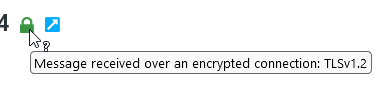
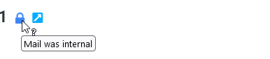

# TLS Icon Plugin for Roundcube

Displays a small icon after the subject line that displays the (presumed) encryption state of received mails. 
- Green lock: TLS1.2 or TLS1.3 with Details
- Blue lock: Internal message from localhost
- Red lock: No encryption

Supported languages:
- [x] English
- [x] Hungarian
- [x] German
- [x] Russian
- [x] Dutch

## Configuration

Add the following lines to your `config.php`:

```php
$config['tls_icon'] = [
    'header_pattern' => '(by <your.mail.server>|from \[127\.0\.0\.1\])',
    'check_pattern' => '\(using TLSv?(1\.[2-3])',
    'local_pattern' => '(mailcowdockerized-dovecot-mailcow-1|127.0.0.1)',
    'tooltip_pattern' =>  '\(using\s(.*?)\s',

];
```

and change the different patterns to match your mail server:

- `header_pattern`: Pattern to match the last hop of the mail server (e.g. `by mail.example.com`)
- `check_pattern`: Pattern to match the encryption state (e.g. `using TLSv1.2`)
- `local_pattern`: Pattern to match the local mail server (e.g. `127.0.0.1`)
- `tooltip_pattern`: Pattern to match the encryption details. Use `()` to extract details. Tooltip uses the first match (e.g. `...(TLSv?1\.[2-3])...`)

## Changelog

v1.0.0
- First release

v1.0.1
- Some bugfix
- Add Hungarian language

v1.0.2
- Link bug fix

v1.0.3
- Add IPv6 Support
- Add Dutch Language

v2.0.0
- Replaced icons
- Improved pattern matching
- Added tooltip for encrypted messages
- Improved translations

## Screenshots

### Encrypted message


### Internal message


### Unencrypted message


## Credits

Original plugin by [oszto90](https://github.com/oszto90/Roundcube_TLS_Icon_with_Hmailserver) and fork from [Takika](https://github.com/Takika/rc_tls_icon). I renamed the plugin to match the plugin naming shema and add more pattern to support more mail servers. 